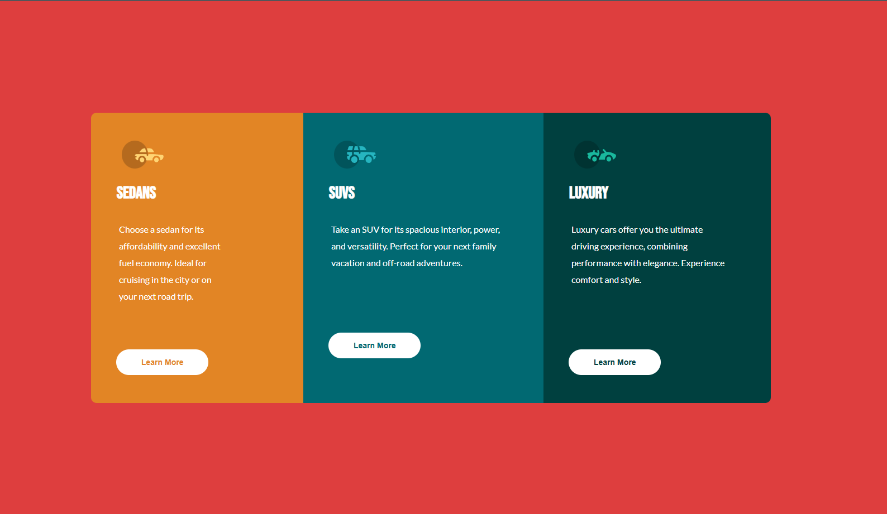
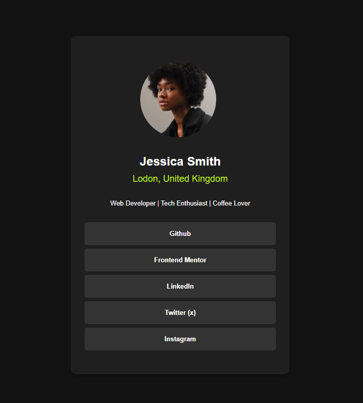
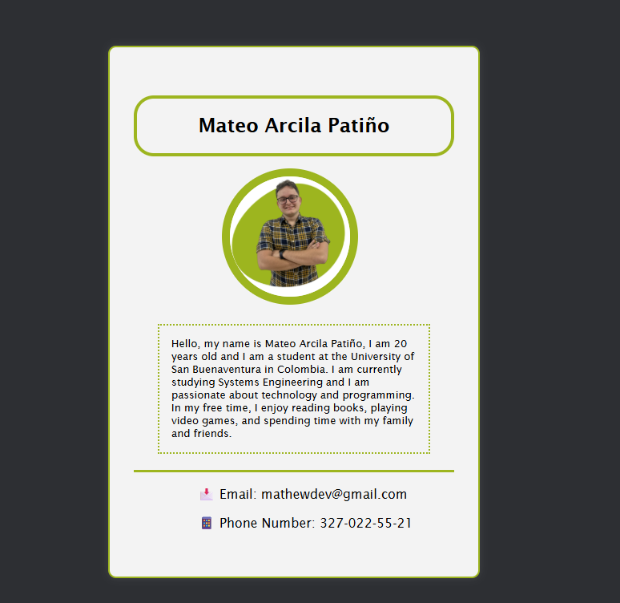

# 🚀 Portafolio de Programación

---

## 👋 Bienvenido
¡Hola! Este es mi **portafolio personal** para la materia de _Introducción a la Programación_ en CESDE. Aquí encontrarás información sobre mí, mis proyectos y habilidades.

---

## 🧑‍💻 Sobre mí
- **Nombre:** Mateo
- 📸 Foto de perfil incluida
- 🎯 Apasionado por la tecnología y el aprendizaje

---

## 📂 Estructura del Proyecto
```
├── Index.html
├── README.md
├── Images/
│   ├── profile-picture.jpg
│   ├── project-one.png
│   ├── project-two.png
│   └── project-three.png
├── Styles/
│   └── styles.css
```

---

## 🌟 Características
- Página principal con diseño moderno
- Sección de proyectos con imágenes
- Estilos personalizados en CSS
- Responsive para distintos dispositivos

---

## 🖼️ Proyectos Destacados
| Proyecto        | Imagen                | Descripción                       |
|----------------|-----------------------|-----------------------------------|
| Proyecto Uno   |    | Primer proyecto realizado         |
| Proyecto Dos   |    | Segundo proyecto destacado        |
| Proyecto Tres  |  | Tercer proyecto innovador         |

---

## 🎨 Personalización
- **Colores y fuentes**: El archivo `styles.css` contiene estilos llamativos y modernos.
- **Imágenes**: Todas las imágenes están en la carpeta `Images`.

---

## 📖 ¿Cómo usar?
1. Abre el archivo `Index.html` en tu navegador.
2. Explora las secciones y proyectos.
3. Revisa el código fuente para aprender más.

---

## 💡 Tecnologías Utilizadas
- HTML5
- CSS3

---

## 📬 Contacto
¿Tienes dudas o sugerencias? ¡Contáctame!

---

> _"La programación es el arte de crear soluciones a través del código."_

---

### ✨ ¡Gracias por visitar mi portafolio! ✨

---

